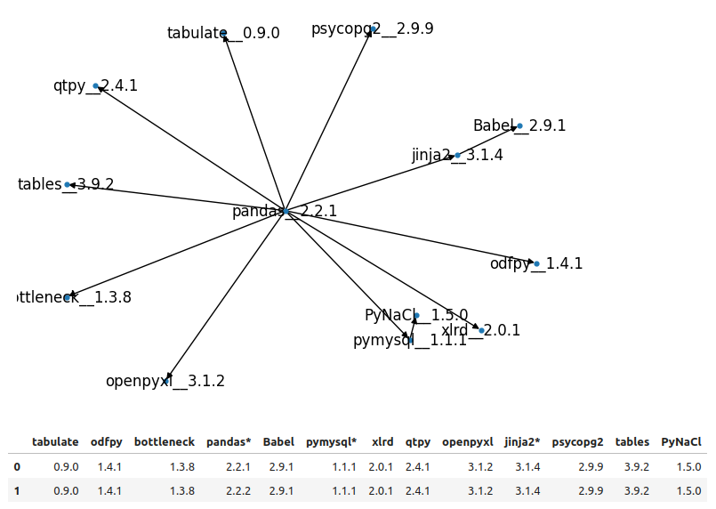

# Cartwheels
* Visualize python dependencies
* Remove transitive dependencies
* Find compatibility sets

## tl;dr;

Install requirements via `setup.py`

```bash
pip install .
```

Run Jupyter lab
```bash
jupyter lab
```

Open [chart_my_wheels](http://localhost:8888/lab/tree/chart_my_wheels.c-matrix.ipynb)
* Link works if you use the default port:`8888`

Change the `dependencies` list to your project requirements


Run all 

The output of the last cell visualizes your dependencies, for example:



As a bonus it also:
* Lists other compatibility (or version) sets

### More info

Explanations of optimizations and methods are inlined both in notebook and classes 

## Troubleshooting

We cache the package, please change the above call and pass the argument 'True' to invalidate cache and refresh pull from [pypi](https://pypi.org). **NOTE:** This could take hours! 

```python
PkgGraph(dependencies, session, trailing).resolve(True)
``` 

The default configuration is to pull the last `5` versions of packages that can be linked from the `dependencies` list. If you need more comprehensive history, change this number accordingly.


#### Software License Disclaimer
##### Disclaimer

The software is provided "as is," without warranty of any kind, express or implied, including but not limited to the warranties of merchantability, fitness for a particular purpose, and non-infringement. In no event shall the authors or copyright holders be liable for any claim, damages, or other liability, whether in an action of contract, tort, or otherwise, arising from, out of, or in connection with the software or the use or other dealings in the software.

##### Key Points to Note:

No Warranty: This software is provided without any warranties, either express or implied. This means there is no guarantee that the software will meet your requirements, operate uninterrupted or error-free, or that defects will be corrected.
Limitation of Liability: The authors or copyright holders are not responsible for any claims, damages, or other liabilities that might arise from the use of the software. This includes any incidental, consequential, or indirect damages.
Use at Your Own Risk: By using the software, you agree to do so at your own risk. It is your responsibility to ensure that the software is suitable for your intended use.
Modifications and Updates: The authors may make changes to the software at any time without prior notice. However, they are not obligated to provide updates, maintenance, or support for the software.
Governing Law: This disclaimer is governed by the laws of the jurisdiction in which the software is used.
This disclaimer is intended to limit the legal liability of the software authors and protect them from potential claims related to the software’s performance or use.
